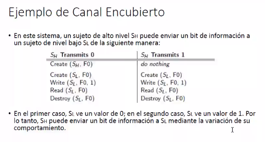
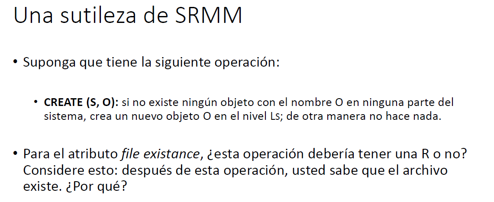
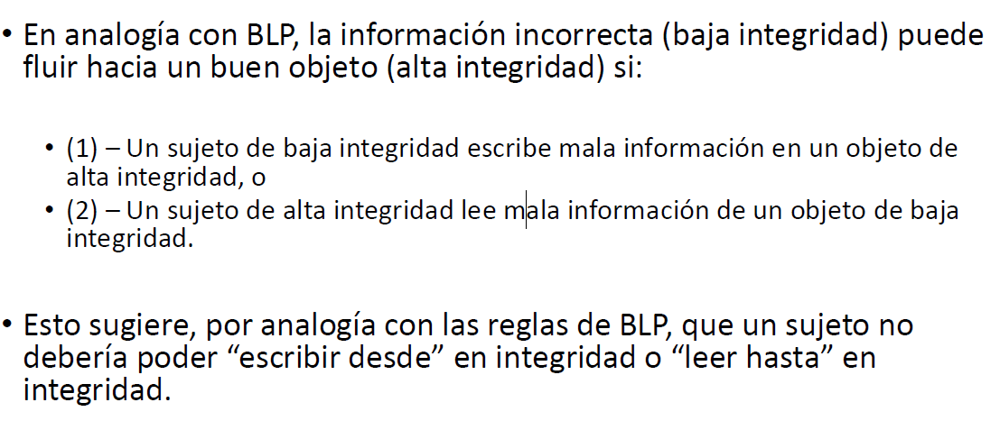
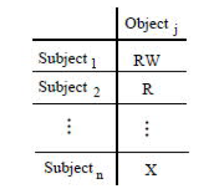

# Apuntes ASSI parte 1

## Clase 1 y 2 Repaso

**Seguridad**: en términos muy grandes viene a ser como proteger nuestros activos de amenazas.

Aquí caen las siguientes preguntas:

• ¿Qué activos?

• ¿Qué tipo de amenazas?

• ¿Qué significa “protección”?

• ¿La naturaleza de la protección varía según la amenaza?

Los activos en este contexto son aquellos elementos \(objetos, sujetos\) que consideremos importantes, mientras que una amenaza es cualquier situación que los ponga en peligro acorde a nuestro contexto.

Al final del dia la seguridad recae en cómo protegernos de las amenazas dependiendo del contexto.

Podríamos hacer una distinción en seguridad **Personal** y seguridad a nivel **Institucional**

A nivel personal uno podría decir que lo deseable es:

• Autenticación \(protección contra “phishing”\)

• Autorización

• Privacidad de sus datos

• Integridad de sus datos

• Disponibilidad

• No Repudio

**Spicy facts:**

* Hubo más de 1 millón de nuevas muestras únicas de malware descubiertas en cada uno de los últimos dos trimestres. A diferencia de los gusanos y los correos masivos del pasado, muchos de estos fueron extremadamente dirigidos a industrias específicas, empresas e incluso hacia usuarios.
* Una vez que los PCs están infectados, tienden a permanecer infectados. La mediana de la duración de la infección es de 300 días.
* Casi el 97% de los sitios tienen una vulnerabilidad grave. – Web Application Security Consortium, septiembre 2008
* La NSA encontró que la correcta o incorrecta configuración de seguridad del software \(más a menudo causadas por errores de configuración en el nivel más bajo\) fueron responsables por el 80% de las vulnerabilidades de la Fuerza Aérea”

**¿Por qué debería importarnos?** Un ataque cibernético podría acceder a cualquier sistema informático y con esto “desafiar la existencia de países”. Nosotros, quienes optamos por pararnos del otro lado somos la primer linea de defensa contra esta amenaza, ya sea a nivel gubernamental o empresarial.

Edúquese usted mismo:

• Mejorar su propia protección

• Contribuir a la seguridad en su lugar de trabajo

• Mejorar la calidad y la seguridad de las transacciones interpersonales

y comerciales

• Mejorar la seguridad general en el ciberespacio

¿Por qué la seguridad sería más difícil que la mayoría de los problemas tecnológicos?

La mayoría de los esfuerzos relacionados con la tecnología están relacionados con asegurar que algo bueno sucede. La seguridad trata de asegurar que las cosas malas nunca sucedan. En seguridad, no solo se tienen que encontrar los “errores” que hacen que

el sistema se comporta en forma diferente a lo esperado, se debe identificar cualquier característica del sistema que sean susceptibles de mal uso y abuso, incluso si sus programas se comportan exactamente como se espera que lo hagan.

Si con la seguridad se trata de asegurar que las cosas malas nunca sucederán, eso significa que tenemos que saber cuáles son esas cosas malas. **Lo más difícil de la seguridad es convencerte de que has pensado en todos los posibles escenarios de ataque, antes de que el atacante piense en ellos.**

_“Un buen ataque es uno en el que los ingenieros nunca pensaron”. – Bruce Schneier._

**La penetración más fácil** : los sistemas de gestión de la información son entornos

complejos, con abundantes adjetivos, compuestos por: hardware,

software, almacenamiento, medios, dispositivos periféricos, datos,

personas.

**Principio de penetración más fácil**: Un intruso usará cualquier medio

disponible para subvertir la seguridad de un sistema.

_**“Si uno pasa por alto las ventanas del sótano mientras evalúa los riesgos a**_

_**su propia casa, no importa cuántas alarmas se pongan en las puertas y**_

_**ventanas de arriba.” – Melissa Danforth**_

* La seguridad es a menudo una ocurrencia tardía. Nadie construye un sistema digital con el fin de estar seguro. Los sistemas digitales se construyen para hacer algo útil.

 _Los mecanismos de seguridad pueden ser vistos como una molestia_

_para ser subvertidos, anulados, o deshabilitados_

**La seguridad perfecta no existe**

* La seguridad perfecta es probablemente imposible en cualquier sistema útil.
* “Las tres reglas de oro para garantizar la seguridad informática son: no poseer una computadora; no encenderla; y no usarla.” – Robert H. Morris, ex Chief Scientist de la National Computer Security Center \(comienzo de los 1980’s\)
* “Desafortunadamente, la única forma de proteger realmente \(su computadora\) actualmente es apagándola, desconectarla de Interner, meterla en una caja de cemento, y enterrarla 30 metros bajo la superficie.” – Prof. Fred Chang, ex Director de Investigación en la NSA \(2009\)

## Seguridad como gestión de riesgos

Si la seguridad perfecta no es posible, ¿Qué se puede hacer?

Viega y McGraw \(Building Secure Software\), afirman que el software y

la seguridad del sistema realmente “tiene que ver con la gestión del

riesgo”.

 **El riesgo es la posibilidad de que una amenaza particular tenga un**

**impacto adverso sobre un sistema de información explotando una**

**vulnerabilidad en particular.**

La evaluación del riesgo debe tener en cuenta las consecuencias de la

explotación.

La gestión de riesgos es un proceso para que una organización

identifique y trate los riesgos en su entorno. Viega y McGraw tenian su propio sistema para identificar los mismos

• \(1\) – Evaluar los activos

• \(2\) – Evaluar las amenazas

• \(3\) – Evaluar las vulnerabilidades

• \(4\) – Evaluar los riesgos

• \(5\) – Priorizar las opciones de contramedidas

• \(6\) – Tomar decisiones de gestión de riesgos

Una vez evaluados hacen los mismo que en ISW2:

• **Aceptación de los riesgos**: la organización tolera los riesgos, por ej. A veces

el costo del seguro es mayor que la pérdida potencial.

• **Evitar los riesgos**: no realizar una actividad que podría generar riesgos, por

ej. No permitir el inicio de una sesión remota.

• **Mitigación del riesgo**: tomar medidas para reducir las pérdidas debidas a

un riesgo; la mayoría de las contramedidas técnicas caen en

esta categoría.

• **Transferencia del riesgo**: cambie el riesgo a otra persona, por ej. contratos

de seguros, sistemas de seguridad para el hogar.

**ALE**: expectativa de pérdida anualizada marca un balance entre probabilidad y costo del suceso. En este caso Teller theft es la peor dada su alta incidencia

## Definiciones Clave:

**Seguridad Informática**

Área relacionada a la informática y telemática enfocada en la protección de todo aquello involucrado con la información e infraestructura de computadoras y de las redes de estas.

Abarca el estudio de una serie de estándares, protocolos, métodos, reglas y herramientas cuyo objetivo es minimizar los riesgos inherentes a los elementos mencionados.

**Ciberseguridad:** comprende software \(bases de datos, metadatos, archivos\), hardware, redes de computadoras y todo lo que la organización valore y signifique un riesgo si

esta información confidencial llega a manos de otras personas, convirtiéndose, por ejemplo, en información privilegiada.

**Seguridad de la Información** es el conjunto de medidas preventivas y reactivas de las organizaciones y de los sistemas tecnológicos que permiten resguardar y proteger la información buscando mantener la confidencialidad, la disponibilidad e integridad de los

datos y de la misma.

## Pilares CID + amigos:

**Confidencialidad:** impide la divulgación de información a todos los individuos, entidades o procesos no autorizados. Asegura acceso a información solo a quienes esten realmente autorizados para verlos.

**Integridad:** propiedad de mantener los datos libres de modificaciones no autorizadas. Busca mantener con exactitud la información tal cual fue generada, sin ser manipulada ni alterada por personas o procesos no autorizados.

**Disponibilidad:** la información está disponible a quienes \(personas, procesos o

aplicaciones\) deban acceder a ella.

**Autenticación:** soy quien digo ser.

**No repudio:** ¿puedo o no negar mis acciones acorde a las políticas adoptadas?

**Privacidad:** se le da esta característica a la información a fin de mantener su alcance fuera de personas no autorizadas o sin el adecuado consentimiento.

¿Cómo protegía los datos?

• Lectura:

* • Contraseña en el archivo. \(Seguridad por obscuridad\)
* • Criptografía

• Acceso

• Áreas de disco asignadas exclusivamente al usuario

• Pérdida

• Respaldos

• Contaminación

• Antivirus

¿Y el acceso a Internet?

**Router:**

• ACL para filtrar el acceso

• Capa 3 del modelo OSI

 **Firewall:**

• Reglas de acceso

• Capa 4 del modelo OSI

**Proxy:**

• Agente autorizado para actuar en nombre de otro

Si ya esta en mi red:

Cual es mas importante?

**Todo contexto**

Clase 2:

Seguridad: Cómo protegernos de las amenazas, depende del contexto.

Esa dependencia entra la pregunta de: si tenemos diferentes nociones de seguridad ¿Como podemos especificar los requisitos de seguridad para un sistema dado?

Aca entran en juego las POLÍTICAS.

## POLÍTICAS

**Políticas**: para cada sistema nos referimos a sus políticas de seguridad, las mismas son un conjunto de reglas para implementar objetivos específicos de seguridad. Son una especie de contrato entre desarrollador y cliente que buscan guiar la seguridad del sistema. Al final del día no dejan de ser más que una expresión de deseo de seguridad más que una verdad.

Ej: ”Los documentos que contienen Cédulas y que son imprescindibles

mantenerlos, deben ser guardados en un archivo seguro.”

**Metapolítica:** objetivo principal de seguridad del sistema. Usualmente se habla de los mismos en términos de los pilares CID. Una política está basada en mecanismos, reglas como firewall por ejemplo mientras estos son **mucho más generales que las políticas,** dejan varias interpretaciones y están compuestas de muchas políticas.

## Seguridad de múltiples niveles \(MLS\)

Permite seguridad bien diferenciada. Empezó como forma de proteger la confidencialidad en cuarteles militares \( general -&gt; sargento -&gt; …\). Maneja distintos niveles de seguridad para diferentes grados de confiabilidad y **controla la info de un sistema para proteger la confidencialidad.**

Para que tenga sentido se categoriza la informacion. Por ejemplo la hora del partido de una base militar no es igual a la hora de ataque, esto implica **distinta sensibilidad.**

Para esto introducimos **Etiquetas de Sensibilidad:** estas definen niveles de confidencialidad acorde a rangos. Por si solas no son suficientes y se complementan con etiquetas acordes a **la necesidad de saber.**

Usamos etiquetas acorde a niveles y tenemos:

Sin clasificar → Confidencial → Secreto → Super secreto.

Luego de necesidad de saber tenes acorde a tu org pero abarcan desde “limpieza” “criptografia” “nuclear”

Ejemplos de etiquetas entonces quedan como la combinacion de ambas:

:

• \(Secreto: {Nuclear, Criptografía}\),

• \(Super-Secreto: {Criptografía}\).

No le metemos mucho pienso NOSOTROS a como se opta por separar

Si un documento tiene información de dos categorías mixtas: suponer una secreta y la otra pública **USAMOS NIVEL MÁS ALTO.**

Si una tiene info de dos dominios **USAMOS AMBAS CATEGORÍAS.**

## Etiquetas de sensibilidad de individuos

Vimos que la información va en carpetas con etiquetas acorde a su nivel de seguridad pero ¿Quién está autorizado a verlas?

**Niveles de autorización**: los individuos reciben estos acorde a la sensibilidad que manejen.

Cada individuo tiene: un nivel de autorización y un conjunto de categorías de saber \(no todos necesitan saber todo y se aplica el llamado conjunto de mínimo privilegio[\[1\]]()\).

Queda tabla al siguiente estilo:

## DEF CLAVE:

**Objetos**: Los contenedores de información protegida por el sistema\(documentos, carpetas, archivos, directorios, bases de datos, etc.\)

**Sujetos**: Entidades que ejecutan actividades y solicitan acceso a los objetos\(usuarios, procesos, etc.\)

**Acciones**: Operaciones, primitivas o complejas, ejecutadas en nombre de sujetos que pueden afectar a los objetos

## Relación dominante

Dado un conjunto de etiquetas de seguridad \(L,C\) compuestos por los niveles jerárquicos \(L\) y de categorías \(C\) podemos definir una relación de ordenamiento entre etiquetas:

\(L1,C1\) domina a \(L2,C2\) sii L1 &gt; L2 en ordenamiento de niveles y C2 esta incluida en C1

Se escribe \(L1,C1\)\(L2,C2\).

Es un **orden parcial** pues existen tags que no cumplen ser A B ni B A

\(L1, Cripto\) y \(L1, Nuclear\) no cumple lo de estar incluido por ejemplo.

priti isi stuf m8.

Vamos a ver como usar esto para decidir quien lee y quien no.

## Propiedad de seguridad simple \(Lectura\)

Un sujeto S con autorización \(Ls, Cs\) puede recibir acceso ade lectura a un objeto clon clasificación \(Lo,Co\) solo si \(Ls,Cs\) \(Lo,Co\).

## Propiedad estrella \* \(Escritura\)

Si yo tengo acceso a top secret y copio algo en no clasificado:

  
Viola seguridad simple? No porque es solo lectura.

Viola confidencialidad? Si porque tengo mas nivel que el que lo leera.

Entonces: Dado un S con autorizacion \(Ls,Cs\) puede escribir en O \(Lo,Co\) solo si:

\(Ls,Cs\) \(Lo,Co\).

Escribe lo máximo que puede leer o para arriba.

Con esta regla:

-Un general no puede mandar ni mails a su subordinados

-Un cabo puede llegar a sobreescribir un plan de guerra \(escribiendo para arriba\).

**¿Porqué escritura segura?** Los sujetos en el mundo de la informática a menudo son programas que operan en nombre de un usuario de confianza \(y con su aprobación\),algunos programas pueden tener una lógica maliciosa incluida \(un caballo de Troya\), que hace que “gotee” información sin nuestro conocimiento o consentimiento.

## ¿Qué pasa con la sobreescritura?

Ahora cabe la pregunta de que pasa si cambian las etiquetas? Por si sola nada de lo anterior dice nada al respecto.

Introduce dos propiedades de tranquilidad:

**Propiedad de Tranquilidad Fuerte**: los sujetos y los objetos no cambian las

etiquetas durante la vida útil del sistema.

**Propiedad de Tranquilidad Débil**: los sujetos y los objetos no cambian las

etiquetas si dicho cambio viola el “espíritu” de la política de seguridad. Básicamente permitiendo a los sistemas variar acorde al principio de privilegio mínimo.

## Bell-LaPadula

La propiedad de Seguridad Simple, la Propiedad \* y la Propiedad de Tranquilidad formalizan una gran parte de la seguridad de múltiples niveles, que a veces también es llamada seguridad militar.

## Políticas de Control de Acceso

El modelo Bell-LaPadula \(BLP\) es un ejemplo de una política de Control de Acceso. Esta es una forma popular de conceptualizar e implementar la seguridad. **La idea básica es introducir reglas que controlen qué accesos los sujetos pueden tomar con respecto a los objetos**

DAC: Discretionary access control: Un encargado asigna o quita privilegios a los usuarios. Si un encargado pierde privilegios que dio son eliminados en cascada.

RBAC: Igual a DAC pero hay jerarquías de roles. Más cómodo de aplicar.

MAC: mandatory access control: asigna un a cada objeto una tag y lo mismo a los sujetos. Obliga propiedad de seguridad simple. Un sujeto con acceso U no puede leer S

## Matriz de Control de Acceso

En general, cualquier política de control de acceso puede ser representada por

una matriz de control de acceso \(ACM\). Dados todos los sujetos y objetos en el sistema, la matriz muestra explícitamente qué accesos están permitidos para cada par de sujeto / objeto

**Matriz de Control de Acceso BLP**

Nota: la matriz sería enorme para la mayoría de los sistemas reales.

Clase 3

Retomando la relación dominante:

Estamos hablando de los 40, no pasa eso de modificar asi como asi, aca se borra cualquier documento que se quiera modificar y se lo vuelve a escribir.

De aqui planteamos lo de la propiedad estrella o propiedad \*. Debo hacer las cosas de tal manera que al dar permiso de escribir algo este documento no cambie. Hoy por hoy no vemos el cambio de un byte, por ejemplo el escribir algo mal y volverlo a escribir. Entonces para controlar la escritura sale esta propiedad.

Solo si: es el caso de que se de la condición este es el entonces de lógica .

Si y sólo si: es que solo ocurre en ese caso.

Permite estos dos: leer hasta y escribir desde.

Al crear un documento este hereda la etiqueta de quien lo crea. \(todavia no lo vimos el crear. solo escribir o leer\).

No se puede leer el documento que tenga elementos que no son mios. Es decir que si soy nuclear no puedo leer algo que es nuclear y cripto.

**Propiedad \*:** Lo que escribe alguien solo lo puede ver los iguales o superiores.

**Propiedad seguridad simple**: leo de mi nivel para abajo

Ahora como hace un general para comunicar a sus subordinados. Por ejemplo a un coronel. -&gt; usan secretarios con un nivel menor.

Si quiere escribir a un soldado pide ayuda a uno para que lo escriba.

El nivel de seguridad va a hacia quien yo escribo eso.

La evolución es tener contenedores para cada persona o rol, esto es lo que hoy se ve poniendo una contraseña para user's \(CREO\). \(Final 1er hora 15/09\)

¿Si tengo elemento con supersecreto de criptografia, lo puedo llegar a cambiar esa etiqueta a publico y sin clasificar?

-&gt; A primera vista es una violacion de confidencialidad

Supongamos que se filtra un documento esté baja automáticamente de etiqueta para el mundo digamos. Hay muchos casos donde la confidencialidad deja de ser tan importante. Ejemplo, compro una patente y dejo de protegerla tanto.

La debilidad: es como patear el tema a la política de seguridad. Por ejemplo al organizar una fiesta sorpresa para un compañero que se casa. No queremos que se entere pero en algún momento se va a enterar \(cuando le caemos a la casa\). Entonces ese documento que teníamos reservado se hace público. Ahi ya no afecta a la política de seguridad, la convocatoria. Antes tenía sentido: no quería que se enteren para que sea secreto, una vez después de la fiesta ya no.

----------------

El modelo bell lapadula es un control de acceso mandatorio pues no modifica etiquetas y las requiere siempre.

Recuerde que el conjunto de etiquetas dentro de nuestro sistema MLS forma un orden parcial bajo la relación de Dominación.

**Lo siguiente también es cierto:**

• LUB – Least Upper Boundary - Dos elementos cualesquiera tienen un límite

superior mínimo \(supremo o join\)

• GLB – Greatest Lower Boundary - Dos elementos cualesquiera tienen un

límite inferior máximo \(mínimo o meet\)

Por lo tanto, el conjunto de etiquetas forma una estructura algebraica llamada Enrejado \(Lattice\).

Puedo cambiar L por H y puedo ir al nivel superior. también puedo agregar la etiqueta A y subir de nivel. Visualizas las transiciones que podes hacer a las etiquetas.

Si hay camino puedes ver BLP. **Puedes leer de un nodo para abajo y podes escribir de un nodo para arriba.**

## Metapolítica blp

**Pregunta tipo parcial: Imaginar 3 niveles de sensibilidad, 3 contenedores A B C. Yo de 1 puedo ir a … armas el grafo y si hay camino puedes aplicar BLP sino no.**

Entonces, si podemos construir un sistema que satisfaga las reglas de BLP y aún así viola la metapolítica, entonces las reglas de BLP no deben ser suficientes.

**Resumen Épico Jornada 3:**

• BLP es una colección de reglas de control de acceso: Seguridad Simple,

Propiedad \*, alguna versión de Tranquilidad.

• El conjunto de etiquetas BLP bajo dominio forma de un enrejado; tal

política es una instancia de seguridad basada en enrejado.

• El objetivo general de BLP \(metapolítica\) es restringir el flujo de

información entre los diferentes niveles de seguridad dentro del enrejado.

• La metapolítica nos da un medio de evaluar si las reglas BLP están a la

altura del trabajo.

------------------------

### SISTEMA BLP SIMPLE:

Crearemos un sistema blp simple. **Estas son las que usaremos en el obligatorio.** Con esto intentamos implementar algo que cumpla la metapolítica anterior.

**El write no crea, ese es como un update.**

**Create sólo funciona si no hay otro objeto o del mismo nombre.**

Si Sl intenta crear un F0 el create no va a hacer nada, entonces intenta escribir y puede escribir su 1. Si quiere leer F0 pero no puede leerlo porque está mal la etiqueta. Como intenté leerlo pero no pudo al no tener permiso interpreta un 0. Luego lo borra ya que puede escribir. Recae todo en la sentencia real. Que dice si el objeto existe o no \(creo\)

**El tema es que a nivel de procesos esto es brutal. A la larga con 0 y 1 sacas un montón de info.**

**Entonces concluimos que puede llegar a fluir información con este blp.**

Clase 4

## Canal encubierto

Definiendo **canal encubierto**:

Un canal encubierto es un camino para el flujo ilegal de información entre sujetos dentro de un sistema, utilizando los recursos del sistema que no fueron diseñados para ser utilizados para la comunicación entre sujetos.

Aspectos de la definición:

•La información fluye en violación de la metapolítica de seguridad aunque no

necesariamente en violación de la política.

• El flujo ocurre **a través de los recursos del sistema** \(atributos de archivo, banderas,

relojes, etc.\) que no estaban destinados a ser canales de comunicación

• El flujo es entre sujetos dentro del sistema; dos usuarios humanos que hablan sobre

el café no es un canal encubierto.

“Lo jodido es detectar cual es ya que puede ser cualquier cosa desde el cpu a los auriculares.“

Un ejemplo:

### 

### 

### Tipos de Canales Encubiertos

• Tiempo: ¿Cuánto tiempo tomó un computo?

• Implícito: ¿Qué camino de control toma el programa?

• Terminación: ¿Finaliza un cálculo?

• Probabilidad: ¿Cuál es la distribución de los eventos del sistema?

• Agotamiento de recursos: ¿Se agota algún recurso?

• Poder: ¿Cuánta energía se consume?

_En la práctica, muchos investigadores distinguen solo los canales de_

_almacenamiento y el de tiempo._

**Los canales encubiertos en los procesadores reales funcionan a miles de bits por segundo, sin un impacto apreciable en el procesamiento del sistema.**

Las características importantes de los canales encubiertos son:

• **Existencia**: ¿Un canal está presente o no?

• **Ancho de Banda**: ¿Cuánta información puede ser transmitida por

segundo?

• **Silencioso / ruidoso**: ¿Puede transmitirse la información sin

pérdida o distorsión?

_Por lo general, no es factible para los sistemas reales eliminar cada_

_canal encubierto potencial._

Una vez que se identifica un posible canal encubierto, se dan varias

respuestas posibles.

• Podemos eliminarlo modificando la implementación del sistema.

• Podemos reducir el ancho de banda introduciendo ruido en el

canal.

• Podemos monitorear los patrones de uso que indican que alguien

está tratando de explotarlo. Esta es una detección de intrusos.

Viendo canales encubiertos de almacenamiento:

### Resumen

Las características importantes de cualquier canal encubierto son:

• Existencia

• Ancho de Banda

• Ruidoso / silencioso

Tratar con un canal encubierto puede incluir:

• Eliminarlo

• Restringir el ancho de banda

• Monitorearlo

Ciertas condiciones deben mantenerse para que exista un canal encubierto.

## Detectando Canales Encubiertos \(Richard Kemmerer Matrix\)

Entra Metodología de la matriz de recursos compartidos \(SRMM\). Tabla que maneja qué acciones tiene cada uno de los recursos compartidos.

Una R significa que la operación Referencia \(proporciona información sobre el atributo bajo

algunas circunstancias\).

• Una M significa que la operación Modifica el atributo bajo determinadas circunstancias.

• Tener en cuenta que esto funciona para canales encubiertos de almacenamiento, no para canales encubiertos de tiempo.

Para el comando read referencio a las variables **existence, size y level**.

Cómo write va a modificar solo se necesita el tamaño.

Con esas instrucciones existe un canal encubierto pues hay un atributo \(File size\) que tiene una fila con R y M. Pues hay operaciones que lo modifican y otros que la lean entonces esas instrucciones me permitirían armar un canal encubierto.

Depende de como es implementada, esta podría rebotar en caso de que ya exista o podrías dárselo a quien lo usa.

* [John Anthony Walker](https://en.wikipedia.org/wiki/John_Anthony_Walker) vendió información confidencial a los rusos encriptando y pasándola a operarios. Al jubilarse le dijo a la mujer q se iba a disfrutar la vida y se divorciaba, esta le dijo q le de la plata escondida. Al negarse esta fue al fbi y dijo que si exponia alta info al fbi no iba presa \(ella era cómplice\)
* [Chelsea Manning](https://es.wikipedia.org/wiki/Chelsea_Manning) soldado que pasaba información para wikileaks de ataques estadounidenses a territorio afgano. Se opero y cambio de sexo en guantanamo. Fue demostrado que fue engañada para pasar la información. Entraba con su mp3 que tiene música de lady gaga y no fue detectado.
* [Edward Snowden](https://en.wikipedia.org/wiki/Edward_Snowden) my waifu.

Lo relevante es que todos lekaron cosas, el primero por ejemplo llevaba cintas que intercambiaba previo a ser quemadas para destruir y salía con ellas. \(no se que tenia q ver con lo otro pero ta interesante y lo tira ahi re spicy\)

## Trabajando con el SRMM

**Si ve una R y M en la misma fila, eso indica un canal potencial.** ¿Por qué?.

• SRMM no identifica canales encubiertos, pero sugiere donde buscarlos.

• Cualquier matriz de recursos compartidos es para un sistema específico.

• Otros sistemas pueden tener diferentes semánticas para las operaciones.

### Canales Encubiertos y Análisis del Sistema

• 1\) Utilice una política de control de acceso como Bell-LaPadula para controlar flujos de información estándar.

• 2\) Utilice una técnica separada como el SRMM de Kemmerer para identificar canales encubiertos.

• 3\) Trate con canales encubiertos cerrándolos, restringiéndolos, o controlándolos.

### Comunicación

-Si SL ve alguna vez resultados variables que dependen de la variación de las

acciones de SH, que eso se puede utilizar para enviar un bit de información de

SH a SL.

-Eso se aplica si la acción de SH es escribir en un archivo o modular algún atributo

del sistema.

-Si la seguridad exige que SH nunca se comunique con SL, no debería haber nada

que SH pueda hacer que tenga efectos visible a SL.

-Esta observación es la base de una política de seguridad muy general llamada

“No Interferencia”

## No Interferencia

La no interferencia es la instancia más conocida de una clase de políticas llamadas políticas de flujo de información

En lugar de limitar las acciones del sujeto, especificamos en qué temas se le permite “interferir con” otros sujetos. Se puede pensar en “interferir con” como que significa “hacer algo que tiene un efecto visible para”.

## MLS para “No Interferencia”

No interfiere porque no tiene un efecto visible.

**Uso de políticas no transitivas:**

### RESUMEN

La No Interferencia es una política de flujo de información, lo que significa que especifica la seguridad del sistema indicando qué flujos son permitidos.

• La política se especifica por una relación reflexiva sobre los sujetos del

sistema que indica que puede “interferir” con los otros.

• NI es muy general. Cualquier política de MLS se puede reescribir

como una política de NI, por no al revés.

### Políticas de No Interferencia

**Básicamente L solo ve lo suyo pues H no debería ser visible.**

Clase 5 \(Integridad\)

Ahora empezamos a hablar de la integridad, de si esta cambia o no cambia, más allá de si lo que estoy leyendo es confiable o no.

**Integridad:** propiedad de mantener los datos libres de modificaciones no autorizadas. Busca mantener con exactitud la información tal cual fue generada, sin ser manipulada ni alterada por personas o procesos no autorizados.

Hace analogía con escuchar una noticia de que encuentran petróleo en tacuarembó por la radio pero que esta no salga en ningún diario. Entonces dice que como no confirmamos con otro medio no es tan confiable.

Recordar eso de las primeras clases.

La integridad se relaciona con cuánto confiamos en que una entidad produzca, proteja o modifique los datos. A diferencia de la confidencialidad, las violaciones de la integridad no

requieren de acciones externas. En algunas aplicaciones, particularmente en el mundo comercial, la integridad es más importante que la confidencialidad.

Además otra diferencia con la confidencialidad es que un programa puede dañar la integridad sin interacción con el mundo externo, simplemente computando datos incorrectamente.

Como lo hicimos con la confidencialidad, podríamos asignar **etiquetas de**

**integridad**:

• La etiqueta de un **objeto** caracteriza el grado de “confiabilidad” de la información

contenida en ese objeto. El chisme oído por casualidad en el ómnibus debería tener una credibilidad menor que un informe de un panel de expertos.

•La etiqueta de un **sujeto** mide la confianza que uno pone en su capacidad de producir

/ manejar la información. Una aplicación certificada puede tener más integridad que el software gratuito descargado de Internet.

La integridad tiene aspectos y principios de funcionamiento no tan relevantes para la seguridad militar.

**•Separación de tareas**: se deben involucrar varios sujetos diferentes para completar una función crítica.

**•Separación de la función**: un solo sujeto no puede completar roles complementarios dentro de un proceso crítico.

• **Auditoría**: la habilidad de recuperación y la responsabilidad requieren mantener una pista de auditoría.

No lo entendí pero no parecía muy importante.

## Preocupaciones Comerciales

Las preocupaciones de Integridad son a menudo más importantes que las

preocupaciones de confidencialidad en entornos comerciales.

Por ejemplo, Steve Lipner \(Microsoft\) describe los problemas de integridad

que es posible encontrar en un entorno de procesamiento de datos comerciales:

• \(1\) – Los usuarios no escribirán sus propios programas, sino que usarán el software

existente.

• \(2\) – Los programadores desarrollan y pruebas las aplicaciones en un entorno de

pruebas, posiblemente utilizando datos artificiales.

• \(3\) – Mover las aplicaciones de desarrollo a producción requiere de un proceso

especial.

• \(4\) – Este proceso debe ser controlado y auditado.

• \(5\) – Los gerentes y auditores deben tener acceso al estado del sistema y a los

registros del sistema \(logs\).

## Resumen

• La integridad se relaciona con cuánto confiamos en que una entidad produzca, proteja o modifique los datos.

• A diferencia de la confidencialidad, las violaciones de la integridad no requieren de acciones externas.

• En algunas aplicaciones, particularmente en el mundo comercial, la integridad es más importante que la confidencialidad.

## Etiquetas de Integridad

• Supongamos que asociamos etiquetas de integridad a los sujetos y a los

objetos en nuestro sistema igual que con confidencialidad. La etiqueta debe reflejar la confiabilidad del sujeto o la fiabilidad de la información en el objeto.

• Requisito importante: las etiquetas de integridad no son tampoco etiquetas de autorización. En un sistema que refuerza la integridad y la confidencialidad, los sujetos / objetos deben tener etiquetas para cada uno.

• Por ejemplo, una información puede ser de dudosa validez pero muy

sensible, o ser altamente confiable y de poca sensibilidad.

¿Cómo se ven las etiquetas? De acuerdo con un modelo popular, las etiquetas de

integridad **se parecen a las etiquetas de confidencialidad de BLP.**

• Un componente jerárquico da el nivel de confiabilidad.

• Un conjunto de categorías proporciona una lista de dominios de competencia

relevante.

• Por ejemplo, un profesor de física podría tener una etiqueta de Integridad:

\(Experto: {Física}\) que significa que tiene un alto grado de credibilidad en su área de experiencia.

Pero no hay ninguna razón particular para confiar en su opinión sobre una cuestión de

política o sobre la cría de animales.

## Relación de Dominio \(INTEGRIDAD\)

Dado que las etiquetas de Integridad tienen la misma estructura que las etiquetas BLP, la relación de Dominio es aplicable. Se define exactamente como con la Confidencialidad.

**\(L1,C1\) domina a \(L2,C2\) sii L1 &gt; L2 en ordenamiento de niveles y C2 esta incluida en C1**

**Se escribe \(L1,C1\)\(L2,C2\).**

Supongamos un conjunto ordenado de niveles jerárquicos: Principiante, Estudiante, Experto

Es lo mismo de que una domina a la otra.

## Metapolítica de Integridad

Al igual que con MLS, queremos definir una política de control de acceso que implemente los objetivos de seguridad \(integridad\) del sistema. ¿Pero cuales son las reglas?

• Recordemos que con MLS, las reglas de BLP fueron realmente diseñadas para restringir el flujo de la información dentro del sistema. A eso le llamamos “Metapolítica”. Entonces, ¿Cuál es la Metapolítica para la integridad?

• Posible respuesta: No permita que la mala información “manche” la buena información. Una formulación alternativa sería: No permita que la información “fluya” en Integridad.

**Vamos a tener que tener una metapolítica para integridad, entonces habrá un conjunto de reglas a implementar que requieren de esta.**

### Metapolítica: Implicaciones

Para cumplir esta metapolítica introducimos un conjunto de reglas similares a la estrella y las de tranquilidad PARA INTEGRIDAD.

### Resumen

Podemos tratar la Integridad por analogía con la Confidencialidad y construir etiquetas como lo hicimos con BLP.

• Sin embargo, la Confidencialidad y la Integridad son cuestiones ortogonales; tenemos que tratarlos por separado.

• Una posible Metapolítica de Integridad sería: La información no debería fluir hacia arriba en Integridad.

## Modelo de Integridad de BIBA

La última es la **política Biba**, las anteriores son medio pijitas al lado.

Todas suponen que asociamos etiquetas de Integridad con sujetos y objetos, análogos a los niveles de autorización en BLP.

Son muy similares a las de bedla padula.

La primera solo puede leer de nivel igual o mayor al mío. Por ejemplo, un principiante puede leer lo que venga hasta la tesis máxima de Perón. Pero si tengo el nivel de decano no me aporta leer nada leer un resumen de yahoo respuestas.

**Biba dice desde mi hacia arriba, Padula dice desde mí hacia abajo.**

La estrella dice que “s” puede escribir si el objeto tiene integridad menor o igual a la mía.

• ¿Qué significa decir que la Integridad de Biba es el “dual” de Bell-LaPadula?

Las reglas respecto a las etiquetas de biba y las de blp están invertidas. Mientras que en blp solo puedo leer desde mi nivel hacia abajo para respetar la confidencialidad en el modelo biba solo puedo leer desde mi nivel hacia arriba para respetar la integridad.

Lo mismo ocurre con la escritura. A modo de usar el modelo blp solo puedo escribir de mi nivel para arriba con el fin de proteger la confidencialidad pero aqui solo podemos escribir de nuestro nivel de integridad para abajo.

## Integridad Estricta ACM

Subj1 es confiable en todos los temas y tiene mayor nivel de lectura que todos los objetos. Entonces no le sirve leer ninguno, ergo no tiene R en ninguno. PERO como es de mayor nivel que el resto y sus categorías contienen a las de todos los objetos puede escribir en todos.

Sujeto 2 no es confiable en ningún tema, puede leer obj1 \(es superior\), puede leer el objeto 2 y el 3. Pero solo puede grabar en el 2.

No podes tirar bolazo en un tema particular. Por ejemplo en el subj 2 el puede escribir ahí en la nada pero si quisiera escribir en \(L,{B}\) no puede.

Ahora subj 3: Sujeto 3 puede leer de su nivel para arriba entonces debería poder leer el obj 3 tambien. **AHI ESTA MAL.** Y no puede escribir en temas que no conoce \(dha\).

A partir de esto salen las siguientes politicas respecto a integridad de datos.

## Política de Integridad de Marca de Agua Inferior \(Low Water Mark Integrity\)

En general, una política de marca de agua es aquella donde un atributo monótonamente flota \(marca de agua superior\) o se hunde \(marca de agua inferior\), pero puede ser “reiniciado” en algún punto.

**Low Water Mark Integrity:** te castiga si lees algo de menor integridad bajando tu nivel. Un botón. Porque es como que contamina lo que sabes.

La gracia es que es una politica dinamica con las siguientes tres reglas:

1. La integridad de un sujeto es el minimo entre la integridad anterior del sujeto y la integridad del objeto que estas acccediendo. \(Basicamente si lees algo menor te castiga\).
2. Para todo S y todo O, un sujeto puede modificar un objeto sii la integridad de S domina a la de O
3. \(Esta no la dimos\) Para todo s1 y s2, s1 puede invocar a s2 si la integridad de s1 domina a s2.

Lo de arriba en versión fea y matemática es asi:

:

• \(1\) – Si **s** lee **o**, entonces i’\(**s**\) = min \(i\(**s**\), i\(**o**\)\), donde i’\(**s**\) es la nueva etiqueta de

integridad del sujeto luego de la lectura.

• \(2\) – El sujeto **s** sólo puede escribir al objeto **o** sólo si i\(**o**\) ≤ i\(**s**\).

Esta política tiene la **desventaja** de que varía a medida que el programa corre entonces algo que era accesible al comienzo del programa puede no serlo a la mitad de la ejecución del mismo.

Un potencial de la política de Integridad de LWM es **disminuir monótonamente el nivel de integridad de un sujeto innecesariamente**. Este tipo de problema se conoce como “arrastrar la etiqueta” y puede dar como resultado un análisis excesivamente conservador.

## Política de Anillo \(Ring Policy\)

Esta politica es mucho mas flexible que la anterior:

• \(1\) – Cualquier sujeto puede leer cualquier objeto, independientemente de los niveles de Integridad.

• \(2\) – Los sujetos pueden escribir en el objeto o solo si i\(o\) ≤ i\(s\). \(Solo si lo domina\)

**La política del Anillo \(Ring\):** podes leer en cualquiera de menor integridad a la tuya.

## 

## Resumen y diferencias:

Visual Biba estricto:

-------------------------------------------------------------------------------------------------------------------

## Modelo de Lipner

• Steve Lipner \(Microsoft\) describió ciertas preocupaciones de Integridad que se podían encontrar en un ambiente de procesamiento de datos comerciales:

• \(1\) – Los usuarios no escribirán sus propios programas, sino que usarán el software existente.

• \(2\) – Los programadores desarrollan y testean aplicaciones en un entorno de pruebas,

posiblemente usando datos artificiales.

• \(3\) – Mover las aplicaciones de un entorno de desarrollo al entorno de producción requiere

un proceso especial.

• \(4\) – Este proceso debe ser controlado y auditado.

• \(5\) – Los gerentes y auditores deben tener acceso al estado del sistema y a los registros del sistema \(Logs\).

• ¿Podemos usar los mecanismos de modelado existentes para construir un

sistema que incluya estas restricciones?

Esto es lo que le da integridad según lipner a los programas. En linux se permite mover de dev a producción. No hay .exe para que sea ejecutable, esto es un atributo que tiene un objeto. Un dato no lo tiene, un programa si y dice quién lo puede ejecutar.

**Lipner ideó su Modelo de Matriz de Integridad para manejar esas preocupaciones a través de una combinación de BLP y de Integridad de BIBA.**

 **Hay dos niveles de confidencialidad:**

• Audit Manager \(AM\): auditoría y gestión del sistema.

• System Low \(SL\): todos los restantes procesos.

 **Además, hay tres categorías de confidencialidad:**

• Production \(SP\): código de aplicaciones de producción y los datos.

• Development \(SD\): aplicaciones en desarrollo

• System Development \(SSD\): programas del sistema en desarrollo

Además de las restricciones de confidencialidad, también imponemos **restricciones de integridad**. Hay tres clasificaciones de integridad \(de mayor a menor\):

• System Program \(ISP\): software del sistema.

• Operational \(IO\): programas de producción y software de desarrollo.

• System Low \(ISL\): comportamiento a nivel de usuario.

• Y dos categorías de integridad:

• Development \(ID\)

• Production \(IP\)

Dos niveles de confidencialidad, y tres categorías de la misma.

En tanto a lo otro hay 3 y 2. \(lit estoy poniendo lo mismo de la fotito pero no dice nada el feli\).

Las cosas \(objetos y sujetos\) van a ser compuestas entonces por los dos modelos: **bell lapadula y Biba.**

### Niveles de Sujetos

Los niveles de seguridad \(tanto en confidencialidad como en integridad\) están asignados a los sujetos basado en sus roles en la organización y sus necesidades de saber.

-_“Degradación” significa la capacidad de mover software \(objetos\) desde desarrollo a_

_producción._

### Niveles de Objetos

Los niveles de seguridad \(tanto la confidencialidad como la integridad\) se asignan a los objetos basado en quién debería acceder a ellos.

Así con este modelo solo podes leer y escribir en tu propio nivel \(creo\). -&gt;Por eso no usamos integridad estricta de biba

### Resumen

• Lipner desarrolló una política híbrida utilizando tanto BLP como la Integridad Estricta de BIBA para abordar los problemas de integridad comercial.

• Se requieren algunas modificaciones relacionadas con la tranquilidad para permitir mover aplicaciones del entorno de desarrollo al entorno de producción.

• El resultado es aceptable, pero no del todo intuitivo. Quizás sería preferible disponer de un nuevo paradigma de modelado.

------------------

## Clark y Wilson:

• El Modelo de Matriz de Integridad de Lipner mostró que BLP y la Integridad Estricta de BIBA se pueden adaptar para producir una política comercial viable.

_Pero no es necesariamente una buena opción._

• David Clark y David Wilson \(1987\) argumentaron que la seguridad tiene sus

propias preocupaciones únicas y merece un modelo elaborado para ese dominio.

• La preocupación primordial es la coherencia entre los diversos componentes del

estado del sistema.

• Ejemplo: En un banco, los fondos al comienzo del día más los fondos depositados

menos los fondos retirados deben ser iguales a los fondos al final del día.

**“si estoy en un banco quiero el saldo de las cuentas que sea íntegro”.**

Clark y Wilson afirmaron que las siguientes son las cuatro preocupaciones

de cualquier modelo de integridad comercial:

• \(1\) – **Autenticación**: La identidad de todos los usuarios debe estar correctamente

autenticada.

• \(2\) – **Auditoría**: Las modificaciones deben ser registradas, para registrar la ejecución

de cada programa ejecutado y por quién, de una manera que no haya dudas.

• \(3\) – **Transacciones bien definidas**: Los usuarios manipulan datos solo de forma

restringida. Solo se permiten accesos legítimos.

• \(4\) – **Separación de tareas**: el sistema asocia a cada usuario con un conjunto válido

de programas que pueden ejecutar y previene modificaciones no autorizadas,

preservando así la integridad y la coherencia con el mundo real.

El usuario no interactúa directamente con el objeto sino que todo pasa por el filtro de la aplicación. Lo clave del modelo es com forma las transacciones bien definidas para autenticar y para performar los pasos exactamente como listados.

Conceptos clave del modelo:

La política se construye en términos de las siguientes categorías:

**• Elementos de datos restringidos \(CDI\):** Los CDI son los objetos cuya

integridad está protegida.

• **Elementos de datos sin restricciones \(UDI\):** Los UDI son objetos no cubiertos por la política de integridad.

• **Procedimientos de Transformación \(TP\):** Los TP son los únicos procedimientos permitidos para modificar los CDI, o tomar la entrada arbitraria del usuario y crear nuevos CDI. Diseñados para llevar el sistema de un estado válido a otro estado válido.

• **Procedimiento de Verificación de Integridad \(IVP\)**: Los IVP son los

procedimientos destinados a verificar el mantenimiento de la integridad de

los CDI.

**Reglas de la Política**

Hay dos tipos de reglas: de Certificación \(C\) y de Ejecución \(E\).

• C1: Todos los IVP deben garantizar que los CDI se encuentren en un estado válido cuando el IVP se

ejecuta.

• C2: Todos los TP deben certificarse como conservadores de la integridad.

• C3: La asignación de TP a los usuarios debe cumplir con la separación de tareas.

• C4: La operación de los TP debe registrarse.

• C5: Los TP que se ejecutan en UNI deben dar como resultado CDIs válidos.

• E1: Solo los TP certificados pueden manipular los CDI.

• E2: Los usuarios solo deben acceder a los CDI mediante TPs para los que están autorizados.

• E3: La identidad de cada usuario que intenta ejecutar un TP debe estar autenticada

Los permisos están codificados como un conjunto de tuplas de la siguiente forma:

**\(user, TP, {conjunto CDI}\)** donde el usuario está autorizado a realizar un procedimiento de

transacción TP, en el conjunto dado de elementos de datos restringidos \(CDI\).

• Cada tupla en la política debe cumplir con todas los requisitos aplicables de las reglas de certificación y ejecución.

Es como bell lapadula pero advanced, introduce básicamente la **creación de roles.**

### Resumen:

## Política de la Muralla China \(Chinese Wall\) \(Brewer y Nash\)

• Las políticas hasta ahora han sido generales. Consideremos una política para una preocupación comercial muy específica: un conflicto de interés potencial y divulgación inadvertida de información por parte de un consultor o contratista.

• Ejemplo: un abogado se especializa en responsabilidad por productos y consultas para American Airlines. Podría ser una violación de la confidencialidad consultar también para

United Airlines. Porque son empresas rivales. Un contrato simultáneo con McDonalds no sería un conflicto.

### Niveles de abstracción

La política se basa en tres niveles de abstracción:

• **Objetos** como los archivos. Los objetos contienen información de una sola

compañía.

• Los **grupos de empresas** recopilan todos los objetos relacionados con una

empresa particular.

• Las **clases de conflicto** agrupan los grupos de objetos para compañías

competidoras.

Ejemplos de clases de conflicto:

• { Ford, Chrysler, GM }

• { Bank of America, Wells Fargo, Citicorp }

• Tenemos una política de control de acceso simple: un sujeto puede acceder a información de cualquier empresa, siempre que ese sujeto nunca acceda a información de una empresa diferente en la misma clase de conflicto.

• Por ejemplo, si usted accede a un archivo de GM, posteriormente estará bloqueado para acceder a cualquier archivo de Ford o Chrysler. Usted tiene la libertad de acceder a los archivos de otras compañías siempre que estén en otra clase de conflicto.

• Tenga en cuenta que los permisos cambian dinámicamente. Los derechos de acceso que cualquier sujeto disfruta dependen de la historia de los accesos anteriores.

Si soy una empresa que da servicios de seguridad y me dan acceso a una clase, no puedo acceder a más de un grupo de empresas bajo esa clase por ejemplo. Por ejemplo, me dejan ver las cuentas de oracle pero no las de microsoft porque ya seria medio jodido eso.

### Muralla China Propiedades:

Formalmente, la política restringe el acceso de acuerdo con las siguientes dos propiedades:

• **\(Muralla China\) Regla de seguridad simple**: Un sujeto S puede recibir permiso para

acceder al objeto O solo si el objeto:

Está en el mismo conjunto de datos que los objetos antes accedidos por S, es decir, “dentro de la Muralla”, o pertenece a una clase de conflicto de intereses completamente diferente.

• **\(Muralla China\) Propiedad \*:** el acceso de escritura sólo esté permitido si:

Cumple seguridad simple y no está en el conjunto de datos de una compañía diferente al solicitado, también ha de tener información de la compañía que se escribe únicamente.

\(No permite hacer inversiones fraudulentas\).

### Notas finales

A diferencia de las políticas anteriores, la política de la Muralla China de Brewer y Nash está diseñada para abordar una preocupación muy específica: **conflictos de interés por un consultor o contratista.**

• Esto ilustra que las políticas de seguridad se pueden diseñar para resolver problemas muy especializados.

• La Muralla China, es una política de control de acceso en la que los accesos son sensibles al historial de los accesos pasados

La política apunta \(es pionera\) del sistema RBAC.

## Control de acceso basado en roles RBAC

El control de acceso basado en roles \(RBAC\) es un marco de seguridad ampliamente utilizado especialmente apropiado para configuraciones comerciales. Tiene como base DAC donde originalmente se asignaron privilegios a usuarios pero a diferencia del mismo se amplía a privilegios para roles jerárquicos, mucho más fácil de aplicar.

• A diferencia de las políticas de control de acceso que asignan permisos a los sujetos, RBAC asocia permisos con funciones / trabajos / roles dentro de una organización.

• **Un rol es una colección de funciones de trabajo que permiten realizar actividades.**

• Los roles dentro de un banco podrían incluir: presidente, gerente, cajero,

auditor, conserje, principiante, etc.

Un individuo tiene:

• Un conjunto de roles autorizados, los que puede utilizar en diferentes momentos.

• Un conjunto de roles activos, que utiliza actualmente.

**ROL ACTIVO**: puede darse que un rol se active de cierta hora a cierta hora. Ejemplo entre las 9 y la 1 tengo un horario de ser cajero y luego entre 3 y 5 puedo autorizar préstamos.

Los roles tienen un conjunto asociado de transacciones, que son actividades[\[2\]]() que alguien en ese rol puede llevar a cabo.

El conjunto de transacciones puede ser específico de la organización: abrir una cuenta, cobrar un cheque, transferir fondos, etc.

### Reglas primarias

Las siguientes son las tres reglas principales del RBAC:

• **Asignación de roles**: un sujeto puede ejecutar una transacción solo si el sujeto

tiene un rol activo.

• **Autorización de roles**: el rol activo de un sujeto debe ser un rol autorizado para

ese sujeto.

• **Autorización de transacción**: un sujeto puede ejecutar una transacción solo si la

transacción está autorizada para uno de los roles activos del sujeto.

• Tenga en cuenta que **un sujeto puede tener múltiples roles**. Por ejemplo, en un instante el presidente del banco también podría actuar como un cajero.

### Subfunciones y Separación de funciones

• **Un rol puede incluir otro**, lo que significa que cualquiera que tenga un rol rj puede hacer al menos las funciones de ri. Ejemplo: un entrenador puede realizar todas las acciones de un aprendiz, así como algunas otras.

•**RBAC también puede modelar la separación de funciones** \(un individuo no

puede asumir ambos roles r1 y r2\). Ejemplo: si “cajero” está entre los roles autorizados de S, “auditor” no puede estar entre los roles de S.

### Ventajas de RBAC

RBAC es generalmente más flexible que las políticas de control de acceso estándar:

• RBAC es fácil de administrar. Todo el mundo con el rol “cajero” tiene los mismos permisos.

• Los permisos son apropiados para la organización: “abrir una cuenta” en lugar de “leer un archivo”.

• RBAC reconoce que un sujeto a menudo tiene varias funciones dentro de la organización.

• RBAC permite que un sujeto haga la transición entre roles sin tener que cambiar identidades.

## Matriz de control de acceso

Podría construir un ACM explícito para cualquier sistema de control de acceso \(por ejemplo, BLP, BIBA, RBAC, etc.\). Pero usualmente no lo hacemos pues se vuelve demasiado complejo en sistemas grandes, estas tablas si estan presentes en la computadora misma pero no visibles a los usuarios. Almacenar la matriz explícitamente es costoso y usualmente

innecesario.

• Existen tres alternativas comunes:

• \(1\) – Mantener un conjunto de reglas para calcular los permisos de acceso “en el aire” en función de los atributos de los sujetos y los objetos.

• \(2\) – Almacena los permisos con los objetos. Esto se llama lista de control de acceso \(ACL\).

• \(3\) – Almacena los permisos con sujetos. Esto se llama sistema basado en las capacidades.

## Lista de Control de Acceso \(ACL\)

• Una lista de control de acceso \(ACL\) almacena los permisos con los objetos del sistema.

• Contiene pares de la forma &lt;S, P&gt;, listando el conjunto de permisos P que el sujeto S actualmente mantiene en el objeto.

• Cualquier solicitud por el sujeto S para el acceso A al objeto O, significa verificar si A Ꞓ P para el par &lt;S, P&gt; en la lista de control de acceso de O.

• Unix / Linux, Mac OS, y Windows, todos almacenan los permisos por medio de ACL.

## Capacidades

Es similar a la lista ACL pero almacenan permisos con sujetos en lugar de objetos. Estas se llaman capacidades.

• Cada sujeto S mantiene una colección de pares &lt;O, A&gt;, que significa que S tiene permiso

actual para realiza el acceso A al objeto O. Para obtener acceso, el sujeto debe presentar

una capacidad apropiada.

• Por lo tanto, una capacidad es un tipo de “boleto”.

• Muchos sistemas basados en capacidades también permiten pasar las capacidades de un

sujeto a otro, bajo circunstancias controladas.

**Sobre la protección de las mismas:**

• La posesión de una capacidad es de hecho una evidencia de permiso.

• Por lo tanto, no se requiere verificación de acceso. Pero para mantener la

seguridad, es necesario asegurar que las capacidades no puedan ser falsificadas o

alteradas.

• Históricamente, se han usado varios enfoques para proteger la integridad de las

capacidades:

• Extender cada ubicación de memoria con un bit adicional indicando si la ubicación contiene o no una capacidad; solo el sistema operativo puede manipular las capacidades.

• Almacenar las capacidades en una memoria especialmente protegida.

_La información de acceso a menudo se almacena implícitamente como una serie de reglas, con cada objeto como una lista de control de acceso, o con cada sujeto como una colección de capacidades._

Clase 6 \(Cripto 101\)

_Codificar un binario de n bits no es lo mismo que mandar un decimal codificado. Para pensar en la codificación hay que hacerlo eficiente._

El paradigma fundamental de la teoría de la

información está representada aquí:

• **Un remitente transmite información a un receptor a través de un canal de comunicación.**

• Información es cualquier contenido para ser

transmitido. Es enviado en la forma de uno o más

mensajes.

• La teoría de la información intenta cuantificar el

contenido de los mensajes y la capacidad de los

canales sobre los que puede fluir la información.

La **teoría de la información** hace preguntas como las siguientes:

• \(1\) - ¿Cuánta información está codificada en un mensaje en particular?

• \(2\) - ¿Con qué eficacia se puede transmitir un alfabeto / idioma determinado?

• \(3\) - ¿Cuál es la capacidad máxima de un medio de transmisión dado?

• \(4\) - ¿Cómo se reduce esa capacidad o eficiencia reducido por una

interferencia / ruido?

¿Por qué nos importa?

• La teoría de la información es muy importante en la informática. Afecta todas las comunicaciones, diseño de hardware, diseño de protocolo, criptografía, tolerancia a fallas, etc.

Por ejemplo, en nuestro contexto actual, es útil saber cuánto la información puede transmitirse a través de un canal secreto específico.

• **Este es el “ancho de banda” del canal. Una forma útil de medir el**

**ancho de banda es en bits por segundo.**

Si tengo que mandar toda la divina comedia por un canal tengo que tener en cuenta que no la puedo mandar sin comprimir. Los compresores de ancho de banda[\[3\]]() generan en el emisor un caché de lo que se repite, reduciendo la cantidad de información que se envía, “expandiendo el ancho de banda”. -&gt; A medida que se repite info se va haciendo más eficiente.

Se hacen cosas como “repetir lo anterior”, ya sea un comando o una palabra, esto lo hace más eficiente.

• \(1\) – En algunos casos, es posible cuantificar el contenido de información de un mensaje.

• \(2\) – Quizás una unidad apropiada de contenido de información sean los bits.

• \(3\) – El Emisor y el Receptor deben tener algunos conocimientos compartidos,

incluido un esquema de codificación acordado.

1: Cuantificar es reducir el envío de datos innecesarios, si las respuestas posibles son “si o no” no mandaremos una de las dos, solo con decir una basta y no enviar nada seria la otra.

## Resumen

La información es cualquier contenido que puede transmitirse desde un Emisor a un Receptor a través de un canal de comunicación.

• La teoría de la información intenta cuantificar la cantidad de información en un mensaje y la capacidad del canal.

• La comunicación requiere algunos conocimientos compartidos

## Cuantificando la información

Supongamos que el Emisor y el Receptor han acordado que el Emisor transmitirá un mensaje de entre exactamente 16 mensajes.

Algo que resume es usar una codificación óptima que no sea inocente, es decir codificando lo que se repite frecuentemente como algo corto. Por eso los cache inteligentes son usados, codifica y guarda en base a eso, también rinde para hacer búsquedas, ejemplo en whatsapp.

A lo que va estos cache guardan básicamente todo, registran de todo lo que se manda para no tener que estar gastando de nuevo.

Entonces para aprovechar eso pensamos, si yo estoy transmitiendo en español uso un diccionario para esto, ahí tengo el idioma y sus palabras frecuentes. Si me mandan algo medio random **supercalifragilisticoespialidoso** le asigno un código y lo tengo q codificar:

-La incorporo al diccionario y le digo al receptor que la incluya también

-Decido q no toma parte del diccionario y la mandó codificada pero no la almaceno

Esto se define en el protocolo.

## Codificación

Esto sugiere que el contenido de información de cualquier mensaje de un espacio de los mensajes K deben ser algo así como:

Pero para obtener una transmisión muy eficiente:

• El Emisor y el Receptor deben saber de antemano el espacio de las posibles transmisiones.

• Deben haber acordado una codificación.

¿Cuánta información contiene el mensaje: “El ataque será al amanecer”?

• Respuesta: **Depende del nivel de incertidumbre del receptor.**

• Si la única incertidumbre fuera si al amanecer o al atardecer: un bit.

• Si el ataque pudo haber venido en cualquier momento durante el día: ? Bits.

• Si el día es incierto ….: ? Bits.

_“La palabra “información” no se relaciona tanto con lo que dices, en cuanto_

_a lo que podrías decir … Es decir, la información es la medida de su libertad_

_de elección cuando selecciona un mensaje”_ –Warren Weaver.

### Resumen

**• El contenido de información de un mensaje es la cantidad de incertidumbre \(lo que no sabe el receptor\) que resuelve.**

**• En una situación ideal, cada bit transmitido puede reducir la incertidumbre a la mitad.**

## Encontrar una codificación

Cuatro bits son adecuados para codificar 16 mensajes posibles: M0, …, M15

\(15 en binario es 1111\)

Esto se llama una codificación “**naïve**”.

• ¿Podemos hacerlo mejor para un mensaje? ¿Qué significa eso?

• ¿Qué hay de la transmisión de n mensajes, cada uno de los cuales es uno de los 16 valores posibles?

Supongamos que necesita enviar 1000 mensajes, cada uno de los cuales puede ser una de 16 posibilidades. Pero en promedio 99,5% será el mensaje 10.

• Pregunta: ¿Todavía requiere 4 x 1000 = 4000 bits para enviar sus 1000 mensajes?

• Respuesta: es posible obtener una codificación que hará mejor en promedio que

la codificación “naïve”.

• Tenga en cuenta, que cuando hablamos de enviar 1000 mensajes, dejamos de

hablar del contenido de información de un mensaje para hablar sobre el

contenido de información de un lenguaje

**Esta parte básicamente refiere a que es posible optimizar el envio de mensajes, manteniendo alguno como “repetido” o algún tipo de reductor de ancho de banda.**

Si usaramos la siguiente codificación:

Dados 1000 mensajes, en promedio 995 de ellos serán el mensaje 10, y 5 serán otros mensajes. Esta codificación toma \(995 x 1\) + \(5 x 5\) = 1020 bits o 1,02 bits por mensaje

• Para cualquier lenguaje, uno puede encontrar una codificación “naïve” que funcionará, pero a menudo es posible hacerlo mejor.

• “Hacer lo mejor” significa utilizar menos bits, en promedio, para transmitir mensajes en el lenguaje.

## Lenguajes

Un lenguaje puede referirse a un lenguaje natural como el inglés o japonés. Pero también puede referirse a cualquier conjunto de símbolos utilizados para formar “cadenas”.

Supongamos una moneda de dos caras. Los símbolos en el lenguaje son “H” \(cara\) y

“T” \(cruz\). Una cadena describe el resultado de tirar repetidamente la moneda al aire y ver el

resultado. Por ejemplo, “HHTHTTTHTTHTHHHTHTT …”.

• Ejemplo 2: Supongamos un dado de seis caras. Los símbolos en el lenguaje son “1”, “2”, “3”, “4”, “5”, “6”. Una cadena describe el resultado de tirar repetidamente el dado. Por ejemplo, “425146261435261 …”

Para cualquier lenguaje, nuestro objetivo es una codificación binaria, con las siguientes propiedades:

• **Lossless** \(sin pérdidas\): debe ser posible recuperar la secuencia original

completa de los símbolos de la transmisión.

• **Uniquely decodable** \(decodificables de manera única\): para cualquier cadena

codificada, debe haber solo una posible decodificación.

• **Streaming** \(transmisión\): no debe haber interrupciones en la codificación.

Supongamos que se tira un dado de 6 caras repetidamente. Los siguientes son algunos

códigos posibles.

Es suficiente \(pero no necesario\) para una decodificación única, la propiedad de **estar libre de prefijos**: Es decir, la cadena que representa cualquier símbolo no pude ser un prefijo inicial de la cadena que representa cualquier otro símbolo.

Imagine un lenguaje que contenga los símbolos A, B, C. ¿Qué hay errado con la

siguiente codificación?

Que se confunde AB con C.

Una codificación puede no tener la propiedad sin prefijo, pero aún así ser

decodificable de manera única.

Encontrando una codificación

• ¿Cómo se obtiene una codificación eficiente? Usar menos bits para los

símbolos que ocurren con más frecuencia.

• Samuel Morse sabía esto instintivamente.

La **codificación de Huffman** está garantizada para encontrar un código

eficiente para un determinado lenguaje si se conocen las probabilidades de

los símbolos en el lenguaje

## Codificación de Huffman

Cada letra refiere a un conjunto de 8 bits, desde el comienzo del almacenado de las mismas esta el problema de querer guardar la menor cantidad de los mismos. Perder un par de bits en streaming no es el fin del mundo pero para el texto puede significar algo grave.

Sin el decir que cada carácter ocupa exactamente 8 bits no es posible que la computadora distinga bien entre los mismos, ademas el tenerlos con una distancia fija es super sencillo buscar entre letras.

Si se busca una codificación donde el espacio sea un 0, la e un 1 y la t 01 ocurre lo mismo que vimos arriba donde no sabe qué hacer con un 001 donde no sabe si es “espacio t” o si es “espacio espacio e”.

La gracia de esta codificación es armar un árbol basado en los caracteres más comunes de un texto dado, a partir del mismo árbol generamos un lenguaje propio para nuestro texto y será mucho más eficiente el guardado del mismo. También guardaremos el árbol como forma de tener nuestra clave de desencriptación.

Pasos:

1:Contamos la cantidad de veces que aparece cada caracter y lo ponemos en una lista ordenada

Tomamos los dos caracteres menos usados \(en el ejemplo de tom scott son justo 1 y 0 pero son caracteres no int\), y los conectamos como la suma de su frecuencia \(2 en este caso\) Y agregamos esta suma a la lista que habíamos armado.

2:

 Continuamos haciendo sumas hasta que uno de los arbolitos que armamos llegue al final de la lista que estabamos recocrriendo.

 Ahora que llega a este punto donde un arbol coincide con una frecuencia de letras los conectamos y lo mandamos para arriba en la lista, contninuando el algoritmo

Llega a armar el arbol de huffman. A partir de esto armaremos nuestra codificacion

Para armar una w tomaremos el camino ese, cada que voy a la drecha \(verde\) va un 1 y cada vez a la izquierda es un 0 \(naranja\)

Esto nos deja con 5 bits y no 8. Algunas ocuparan más de 8 pero son mucho menos probables

El árbol también ha de guardarse, no siempre es eficiente la traducción pero no importa mucho ya que el tema es ahorrar espacio en textos largos.

Para descomprimir es al revez del árbol.

Huffman demostró que es la mejor forma de codificar, a menos que se trabaje con bloques de más de un carácter pero esta es la base.

## Entropía

La entropía mide el contenido de la información promedio de los símbolos en el lenguaje.

Si se conocen las probabilidades de los símbolos en el lenguaje, se puede calcular el contenido de información promedio de un símbolo en el lenguaje.

Para nuestro ejemplo de la moneda equilibrada, la respuesta calculada es de 1 bit por símbolo

La entropía H se calcula de la siguiente manera. Si pi es la probabilidad del i-th símbolo en el

lenguaje, entonces

Cálculo de entropía:

**¿Qué significa decir que la entropía de este lenguaje es 1?**

• \(1\) – En promedio, hay un bit de información en cada símbolo de el lenguaje.

• \(2\) – Es imposible encontrar una codificación que use menos de un bit por

símbolo, en promedio.

• \(3\) – Cualquier codificación que use un bit por símbolo, en promedio, es

óptimo.

Por lo tanto, para este ejemplo, la codificación naïve es la óptima codificación.

Siempre que tenga n símbolos, todos igualmente probables, la probabilidad de cualquiera de ellos es 1/n. El lenguaje tiene una entropía

Supongamos que tenemos una moneda desequilibrada que es tres veces más probable

para obtener una cara \(H\) que una cruz \(T\). ¿Cuál es la entropía de este lenguaje?

**Esto dice que teóricamente es imposible codificar este lenguaje utilizando menos de**

**0,811 bits \(en promedio\) para transmitir el resultado de cada lanzamiento de la moneda.**

Dadas las probabilidades de los símbolos en un idioma, puedes calcular su entropía.

• La entropía mide el contenido de la información promedio de los

símbolos en el lenguaje.

• La entropía establece un límite inferior en la eficiencia de la

codificación.

\(aca habla de tiradas dobles no lo entendi\)

## Entropía fuente

• La entropía de un lenguaje es una medida de la codificación más

eficiente posible del lenguaje.

• La entropía de una fuente de mensaje es la cantidad de contenido de

información que la fuente puede producir en un periodo

determinado.

• Esto es medido en bits por segundo.

• Cualquier canal puede transmitir una cantidad arbitraria de

información, dado suficiente tiempo y capacidad ilimitada de

almacenamiento de “buffer”.

### Teorema fundamental del canal silencioso [\[4\]]()\(Shannon\):

• Si un lenguaje tiene entropía h \(bits por símbolo\) y un canal puede transmitir C bits por segundo, luego es posible codificar la señal de tal manera de transmitir a una velocidad promedio de \(C / h\) - ϵ símbolos por segundo, donde ϵ puede hacerse arbitrariamente pequeño. No es posible transmitir a una velocidad promedio mayor que C / h.

El teorema aplicado:

Supongamos que un canal puede manejar 100 bits / segundo y su lenguaje tiene una entropía de 5 \(bit por símbolo\).

• Dada una codificación perfecta y un canal silencioso, se esperaría

poder transmitir 20 símbolos / segundo a través del canal, en

promedio. ¿Correcto?

C=100bits por segundo

Entropia = 5 bit por simbolo

100/5 = 20.

• Pero es posible que no tenga una codificación perfecta. No importa.

**• Siempre se puede encontrar una mejor codificación para estar dentro**

**del ϵ de ese límite.**

### Teorema fundamental de un canal ruidoso \(Shannon\):

Si el canal es ruidoso, el ruido reduce la capacidad. Pero lo siguiente es verdad:

Dado un canal discreto con una capacidad C y una fuente discreta con una entropía h \(bit por segundo\). Si h &lt; C existe un sistema de codificación de modo que la salida de la fuente pueda transmitirse a través de un canal con una frecuencia arbitrariamente pequeña de errores.

• Si el canal \(con ruido incorporado\) puede manejar físicamente el tráfico de mensajes, entonces es posible transmitir con una tasa de errores arbitrariamente baja.

El resultado de esto es que un mensaje puede transmitirse confiablemente incluso sobre un canal muy ruidoso mediante el aumento de la redundancia del esquema de codificación.

• Por ejemplo, **los canales ocultos en el sistema no pueden descartarse con el argumento de que son ruidosos y, por lo tanto, inútiles.**

• Siempre se puede transmitir el mensaje encontrado una codificación más redundante.

### Teoremas de shannon

La entropía proporciona un límite en la eficiencia de la codificación. Pero los teoremas de Shannon muestran que siempre es posible acercarse a ese límite arbitrariamente cerca

## Entropía vs. Redundancia

Intuitivamente, la diferencia entre la eficiencia de la codificación y la entropía es una medida de la redundancia en la codificación.

• Si encuentra una codificación con eficiencia que coincida con la entropía y no hay redundancia.

• La codificación estándar para el inglés contiene mucha redundancia.

Fr xmpl, y cn prbbly gss wht ths sntnc sys, vn wth ll f th vwls mssng.

Los spammers cuentan con la capacidad de los humanos para descifrar dicho texto, y la incapacidad de las computadoras para hacerlo, para derrotar a los filtros antispam: ¿Te importa pedir Vi@gra o Vigara?

### Modelo de orden cero

Supongamos que queremos transmitir texto en inglés \(26 letras y un

espacio\). Si suponemos que todos los caracteres son igualmente probables, la

entropía es:

Pero no es verdad, los caracteres no son equiprobables.

En inglés escrito o hablado, algunos símbolos ocurren mucho más frecuentemente que otros.

Suponiendo que todos los símbolos son independientes entre sí, pero siguiendo

las probabilidades de anteriores, la entropía es de 4.219 bits por símbolo. Este es

el modelo de inglés de “**primer orden**”

La suposición de independencia \(memoria cero\) también es incorrecta. Algunas

letras siguen otras letras con frecuencia; otras no en absoluto. A continuación, se muestran los di-gramas y tri-gramas más comunes en inglés

Aquí consideramos entropías de orden superior.

Agregar di-gramas al cálculo da un modelo de segundo orden; agregar tri-gramas

da un modelo de tercer orden; etc. Un modelo de tercer orden rinde 2,77 bits por símbolo. La entropía actual es el “límite” de este proceso de tomar modelos de ordenes más y más altos. Las estimaciones de Shannon basadas en experimentos humanos han producido

valores tan bajos como 0,6 a 1.3 bits por símbolo

**Todos los lenguajes naturales contienen redundancia significativa. Capturar la entropía de un lenguaje natural es difícil y requiere modelos complejos.**

## Entropía y Aleatoriedad

Si el contenido de información de un mensaje es igual a la longitud del mensaje

codificado, no hay redundancia.

Algunas fuentes definen una cadena aleatoria como una que no puede ser representada de manera más eficiente. \(Es decir, no es posible la compresión\)

Lempel-Ziv es un algoritmo de “codificación adaptativa” utilizado en muchas herramientas comerciales de compresión de texto. Construye una codificación de acuerdo a las cadenas que encuentra. • Lempel-Ziv es asintóticamente óptimo. Es decir, como la longitud del

texto tiende al infinito, la comprensión se acerca a lo óptimo

El contenido de información de un mensaje es relativo al estado del

conocimiento de un observador.

• Si la eficacia de una codificación coincide con la entropía no hay

redundancia para comprimir.

• La codificación de Huffman y los algoritmos de Lempel-Ziv ambos dan

códigos altamente eficientes.

Cuestionario pre parcial

Etiquetas de sensibilidad

+

Respuesta correcta

La respuesta correcta es:

DAC - Discretionary Access Controls

La etiqueta de sensibilidad define el nivel de acceso permitido a la información

Muy bien. Los objetos no acceden a los sujetos, son los sujetos los que acceden a los objetos.

La respuesta correcta es 'Falso'

**¿En el contexto de seguridad de la información que se entiende por Confidencialidad y por Integridad?**

a. La confidencialidad significa que se debe garantizar que la información es accedida solamente por los sujetos autorizados. La integridad se trata de detectar cambiós en la información realizados de formas no autorizadas

**6\) Nombre y explique un ejemplo de un riesgo que se acepta, uno que se mitiga y uno que se transfiere**

a. Es posible que los dispositivos móviles sean infectados con virus si no tienen antivirus

b. Se coloca antivirus en los móviles

c. No se permite utilizar dispositivos móviles en los sistemas informáticos de la empresa

**7\) Explique brevemente el control de flujo de la información \(simple security property y \*-property\) de Bell Lapadula**

a. simple security property: no se puede leer datos de un nivel de clasificación superior

b. \*-property: no se puede escribir en un nivel de clasificación inferior

**10\) La disponibilidad de un recurso se define como:**

a. La propiedad que tiene un sistema o recurso de estar accesible y utilizable \(correcta\)

b. Asegurar que los datos transmitidos en una conexión no fueron modificados

c. proteger contra el acceso no autorizado a los recursos de una entidad

d. Ninguna de las anteriores

## Links:

Bell-lapadula:

[Security Models Pt 1 Bell-La Padula and Biba \(CISSP Free by Skillset.com\)](https://www.youtube.com/watch?v=SfryxGRXoVg)

Wilson, Muralla China:

[https://youtu.be/VPvZbMXfv\_0](https://youtu.be/VPvZbMXfv_0)

