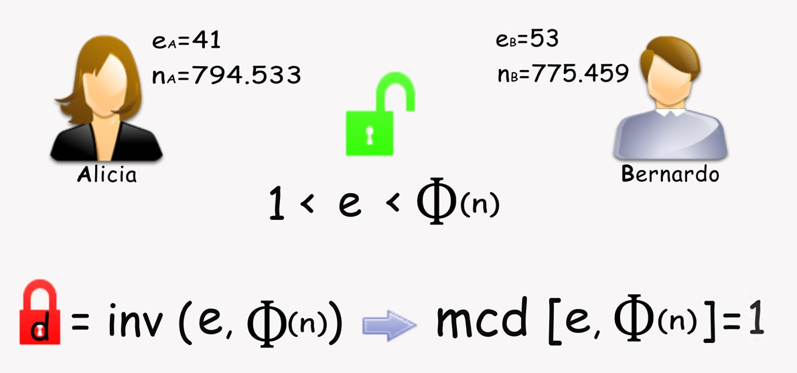

# Algoritmo RSA

Se trata de un algoritmo de clave publica. La base de la logica detras del mismo es como se utiliza una clave resultante en la multiplicacion de dos numeros primos, y se requiere conocer ambos para lograr desencriptar el mensaje. Es hasta el dia de hoy uno de los algoritmos mas utilizados.

Las iniciales surgen de las iniciales de sus tres creadores \(Rivest Shamir Adelman\). Ellos propucieron en su momento un desafio para ver quien podia averiguar su numero original, el RSA129 el cual era compuesto por 129 caracteres. Hoy en dia las longitudes utilizadas aumentaron significativamente pero siguiendo la logica de usar numeros primos.

## Algoritmo

Primero hemos de generar claves.

Se comienza con la obtencion de claves, basicamente obtenidas por la multiplicacion de numeros primos y alguna operacion adicional como el calculo del indicador de euler \(Phi que vemos a la derecha\).

_\(_ [_teorema de Euler_](https://es.wikipedia.org/wiki/Teorema_de_Euler) _que dice que:_ _para todo a coprimo con n. La función φ juega también un papel clave en la definición del sistema de cifrado_ [_RSA_](https://es.wikipedia.org/wiki/RSA)_.\)_

Lo que muestra re complicado ahi es que se ha de elegir un numero e dentro de esos valores.

Finalmente usando algunos teoremas de Euler que no vale la pena meterse se obtiene una clave privada secreta d en base a esas funciones. Lo importante es que e es la clave publica y d la privada, obtenidas en base a numeros primos multiplicados.

Envio y decifrado

Esto solo funciona con numeros primos por lo que es sumamente dificil de desifrar sin ellos. 

